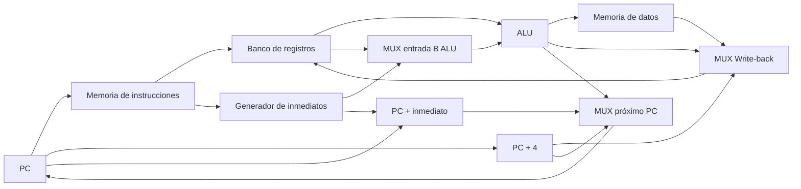

# Datapath conceptual sin pipeline

Este documento describe el camino de datos conceptual del procesador antes de dividirlo en las etapas IF, ID, EX, MEM y WB.

El objetivo es mostrar qué bloques se reutilizan entre las distintas familias de instrucciones y qué decisiones debe tomar posteriormente la unidad de control.

## Diagrama general

Este dibujo es conceptual. No significa que todas las conexiones estén activas al mismo tiempo.

## Significado de los caminos principales

- `PC → IMEM`: el PC proporciona la dirección de la instrucción que debe buscarse.
- `IMEM → RF`: la instrucción permite identificar los registros rs1, rs2 y rd.
- `IMEM → ImmGen`: la instrucción permite reconstruir el inmediato cuando corresponde.
- `RF / ImmGen → MUX → ALU`: el MUX selecciona si la segunda entrada de la ALU proviene de rs2 o del inmediato.
- `ALU → DMEM`: en loads y stores, la ALU calcula la dirección efectiva de memoria.
- `ALU / DMEM / PC+4 → MUX Write-back`: se selecciona qué valor será escrito en rd.
- `PC+4 / PC+inmediato / ALU → MUX próximo PC`: se selecciona la próxima dirección del PC.

## Recorrido de instrucciones

### ADD

`add x6, x3, x5`

Recorrido:

`PC → IMEM → RF(rs1, rs2) → MUX_ALU → ALU → MUX_WB → RF(rd)`

La ALU recibe los contenidos de rs1 y rs2 y realiza la suma.

Próximo PC: `PC + 4`.

### ADDI

`addi x6, x3, 10`

Recorrido:

`PC → IMEM → [RF(rs1) + ImmGen] → MUX_ALU → ALU → MUX_WB → RF(rd)`

La ALU recibe el contenido de rs1 y el inmediato.

Próximo PC: `PC + 4`.

### LW

`lw x5, 12(x6)`

Recorrido:

`PC → IMEM → [RF(rs1) + ImmGen] → MUX_ALU → ALU → DMEM → MUX_WB → RF(rd)`

La ALU calcula la dirección efectiva:

`contenido(rs1) + inmediato`

La memoria de datos se lee y el dato obtenido se escribe en rd.

Próximo PC: `PC + 4`.

### SW

`sw x5, 12(x6)`

Recorrido:

`PC → IMEM → [RF(rs1, rs2) + ImmGen]`

Para calcular la dirección:

`RF(rs1) + ImmGen → MUX_ALU → ALU → DMEM(dirección)`

Para escribir el dato:

`RF(rs2) → DMEM(dato de escritura)`

La ALU calcula:

`contenido(rs1) + inmediato`

rs2 no participa de esa suma: contiene el dato que será almacenado en memoria.

Próximo PC: `PC + 4`.

### BEQ

`beq x3, x4, 16`

Se realizan dos caminos en paralelo.

Comparación:

`PC → IMEM → RF(rs1, rs2) → ALU`

Cálculo del destino:

`PC + ImmGen → TARGET`

El MUX del próximo PC selecciona:

- Si `rs1 == rs2`: `PC + inmediato`
- Si `rs1 != rs2`: `PC + 4`

BEQ no escribe ningún registro destino.

### JAL

`jal x1, 16`

Se realizan dos caminos.

Dirección del salto:

`PC + ImmGen → TARGET → MUX próximo PC → PC`

Escritura del registro destino:

`PC → PC+4 → MUX_WB → RF(rd)`

Por lo tanto:

`rd = PC + 4`

`PC nuevo = PC + inmediato`

### JALR

`jalr x1, 8(x5)`

Se realizan dos caminos.

Dirección del salto:

`IMEM → [RF(rs1) + ImmGen] → MUX_ALU → ALU → MUX próximo PC → PC`

La ALU calcula:

`contenido(rs1) + inmediato`

Escritura del registro destino:

`PC → PC+4 → MUX_WB → RF(rd)`

Por lo tanto:

`rd = PC + 4`

El destino del salto se obtiene a partir de `contenido(rs1) + inmediato`.