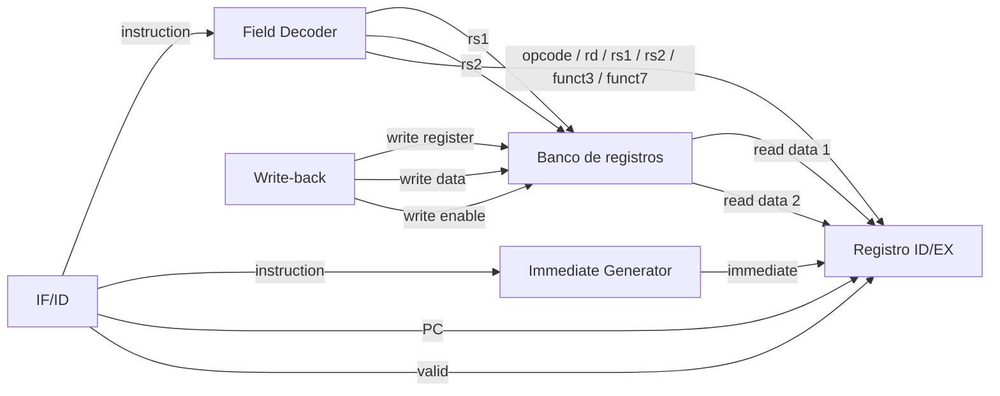

# Etapa ID — Instruction Decode

Este documento describe el diseño conceptual de la etapa ID del procesador segmentado.

ID recibe la información almacenada en IF/ID y prepara los datos que serán utilizados posteriormente por la etapa EX.

## Responsabilidades

La etapa ID debe:

- recibir el PC, la instrucción y el bit de validez provenientes de IF/ID;
- extraer los campos principales de la instrucción;
- leer los registros fuente rs1 y rs2;
- reconstruir el inmediato según el formato de la instrucción;
- recibir desde WB los datos necesarios para escribir el banco de registros;
- mantener x0 permanentemente en cero;
- almacenar en ID/EX toda la información necesaria para las etapas posteriores;
- permitir detener ID/EX mediante un enable;
- permitir invalidar ID/EX mediante un flush.

## Flujo general

## Entradas provenientes de IF/ID

La etapa recibe:

- `if_id_pc`
- `if_id_instruction`
- `if_id_valid`

Estos valores corresponden siempre a la misma instrucción.

## Entradas provenientes de WB

El banco de registros debe poder recibir simultáneamente información desde una instrucción anterior que se encuentre en Write-back.

Las entradas serán conceptualmente:

- `wb_write_enable`
- `wb_write_register`
- `wb_write_data`

ID no genera estos valores: solamente los recibe para permitir que WB actualice el banco de registros.

## Bloques internos

La primera versión de ID estará formada por cuatro bloques principales:

1. `field_decoder`
2. `register_file`
3. `immediate_generator`
4. `id_ex_register`

Posteriormente estos bloques serán integrados mediante `id_stage`.

## Interfaz conceptual de ID/EX

El registro ID/EX debe conservar la información preparada durante Instruction Decode para que la etapa EX pueda utilizarla en el ciclo siguiente.

Los campos inicialmente definidos son:

- `id_ex_pc`
- `id_ex_read_data1`
- `id_ex_read_data2`
- `id_ex_immediate`
- `id_ex_rs1`
- `id_ex_rs2`
- `id_ex_rd`
- `id_ex_opcode`
- `id_ex_funct3`
- `id_ex_funct7`
- `id_ex_valid`

Los números de registro `rs1` y `rs2` se conservan además de sus valores leídos porque posteriormente serán necesarios para la detección y resolución de hazards.

El registro destino `rd` debe avanzar por el pipeline porque identifica dónde deberá escribirse posteriormente un resultado.

Los campos `opcode`, `funct3` y `funct7` permiten conservar la información necesaria para determinar posteriormente la operación correspondiente.

## Control de ID/EX

La prioridad conceptual será:

`reset > flush > enable > mantener`

- `reset = 1`: ID/EX queda inválido y vuelve a un estado conocido.
- `flush = 1`: `id_ex_valid` se coloca en cero.
- `enable = 1`: ID/EX captura todos los datos preparados por ID.
- `enable = 0`: ID/EX conserva su contenido.

El control de avance de ID/EX es independiente de la escritura del banco de registros proveniente de WB.

## Interfaz conceptual de ID/EX

El registro ID/EX conserva la información preparada durante Instruction Decode para que la etapa EX pueda utilizarla en el ciclo siguiente.

Los campos definidos son:

- `id_ex_pc`
- `id_ex_read_data1`
- `id_ex_read_data2`
- `id_ex_immediate`
- `id_ex_rs1`
- `id_ex_rs2`
- `id_ex_rd`
- `id_ex_opcode`
- `id_ex_funct3`
- `id_ex_funct7`
- `id_ex_valid`

Los números de registro `rs1` y `rs2` se conservan además de sus valores leídos porque posteriormente serán necesarios para la detección y resolución de hazards.

El registro destino `rd` debe avanzar por el pipeline porque identifica dónde deberá escribirse posteriormente un resultado.

Los campos `opcode`, `funct3` y `funct7` conservan información necesaria para determinar posteriormente la operación correspondiente.

## Control de ID/EX

La prioridad implementada es:

`reset > flush > enable > mantener`

- `reset = 1`: ID/EX vuelve a un estado conocido y queda inválido.
- `flush = 1`: `id_ex_valid` se coloca en cero.
- `enable = 1`: ID/EX captura los datos preparados por ID.
- `enable = 0`: ID/EX conserva su contenido.

Durante un flush no es necesario borrar físicamente todos los campos del registro. Al colocar `id_ex_valid = 0`, el contenido restante deja de representar una instrucción válida.

El control de avance de ID/EX es independiente de la escritura del banco de registros proveniente de WB.

## Implementación RTL

La etapa ID fue dividida en los siguientes módulos:

- `register_file.sv`
- `field_decoder.sv`
- `immediate_generator.sv`
- `id_ex_register.sv`
- `id_stage.sv`

### Banco de registros

El banco contiene 32 registros.

Posee:

- dos puertos de lectura combinacional;
- un puerto de escritura secuencial;
- protección permanente del registro `x0`.

Las lecturas dependen directamente de `rs1` y `rs2`.

La escritura se realiza en el flanco ascendente cuando:

`write_enable = 1`

y:

`write_register != 0`

Las escrituras dirigidas a `x0` son ignoradas y las lecturas de `x0` siempre producen cero.

El reset utilizado es síncrono y coloca los registros en cero.

### Field Decoder

`field_decoder` es completamente combinacional.

Extrae de la instrucción:

`opcode = instruction[6:0]`

`rd = instruction[11:7]`

`funct3 = instruction[14:12]`

`rs1 = instruction[19:15]`

`rs2 = instruction[24:20]`

`funct7 = instruction[31:25]`

El módulo solamente realiza cortes físicos sobre los bits de la instrucción.

Que un conjunto de bits sea expuesto como `rd`, `rs2` o `funct7` no significa que ese campo tenga significado semántico para todos los formatos.

Por ejemplo, en una instrucción tipo I los bits observados físicamente como `rs2` forman parte del inmediato.

De forma similar, en formatos S o B los bits observados físicamente como `rd` forman parte del inmediato.

La futura unidad de control determinará qué campos son relevantes para cada instrucción.

### Immediate Generator

`immediate_generator` reconstruye un valor de 32 bits según el opcode de la instrucción.

Se implementaron los formatos:

- I;
- S;
- B;
- U;
- J.

Los formatos I y S reconstruyen el inmediato y realizan extensión de signo.

Los formatos B y J reconstruyen los campos distribuidos en la instrucción, incorporan el bit inferior implícito en cero y realizan extensión de signo.

El formato U conserva los 20 bits superiores correspondientes y agrega 12 ceros en la parte inferior.

Para instrucciones sin inmediato útil, como las instrucciones de tipo R utilizadas actualmente, el módulo produce cero.

### Registro ID/EX

`id_ex_register` almacena:

- PC;
- valores leídos de rs1 y rs2;
- inmediato;
- números rs1, rs2 y rd;
- opcode;
- funct3;
- funct7;
- valid.

Su prioridad es:

`reset > flush > enable > mantener`

Un stall se implementa mediante `enable = 0`.

Un flush invalida la instrucción mediante `valid_out = 0` sin necesidad de borrar el resto de los campos.

### Integración de ID

`id_stage` conecta todos los bloques anteriores.

La instrucción proveniente de IF/ID se entrega en paralelo al `field_decoder` y al `immediate_generator`.

Los campos `rs1` y `rs2` obtenidos por el decoder seleccionan los dos registros fuente del banco.

El banco también recibe de WB:

- `wb_write_enable`;
- `wb_write_register`;
- `wb_write_data`.

Los datos preparados combinacionalmente son capturados por ID/EX en el siguiente flanco cuando `id_enable = 1`.

La escritura proveniente de WB es independiente de `id_enable`. Por lo tanto, una instrucción más antigua puede completar su escritura en el banco mientras ID/EX permanece detenido.

## Validación mediante simulación

Las simulaciones fueron realizadas con Vivado/XSim 2025.1 utilizando SystemVerilog.

El flujo utilizado fue:

`xvlog -> xelab -> xsim`

Para inspeccionar waveforms se utilizó elaboración con:

`-debug typical`

### register_file

Resultado:

`PASS: register_file`

Se verificó:

- reset;
- escritura secuencial;
- dos lecturas combinacionales simultáneas;
- escritura en registros distintos;
- protección de `x0`;
- conservación del registro cuando `write_enable = 0`.

### field_decoder

Resultado:

`PASS: field_decoder`

Se verificaron instrucciones de diferentes formatos:

- `add x6, x3, x5`;
- `addi x6, x3, 10`;
- `sw x5, 12(x6)`;
- `beq x3, x4, 16`.

Las waveforms permitieron comprobar que los cortes de campos responden combinacionalmente al cambio de instrucción.

También se verificó que campos físicamente extraídos pueden no tener significado semántico para determinado formato.

### immediate_generator

Resultado:

`PASS: immediate_generator`

Se verificaron:

- I positivo;
- I negativo;
- S positivo;
- S negativo;
- B positivo;
- B negativo;
- U;
- J positivo;
- J negativo;
- tipo R sin inmediato útil.

Se comprobó correctamente la extensión de signo.

Ejemplos observados:

`addi ..., 10 -> 0x0000000A`

`addi ..., -4 -> 0xFFFFFFFC`

`beq ..., 16 -> 0x00000010`

`jal ..., -8 -> 0xFFFFFFF8`

`lui ..., 0x12345 -> 0x12345000`

### id_ex_register

Resultado:

`PASS: id_ex_register`

Se verificó:

- reset;
- captura normal;
- stall mediante `enable = 0`;
- flush;
- nueva captura después de un flush;
- prioridad de reset sobre flush y enable.

Durante el flush se comprobó que los datos permanecen físicamente almacenados mientras `valid_out` pasa a cero.

### id_stage

Resultado:

`PASS: id_stage`

La simulación integral finalizó en 106 ns.

Se verificó el funcionamiento conjunto de:

- field decoder;
- banco de registros;
- immediate generator;
- registro ID/EX.

La secuencia de prueba incluyó:

`WB -> x3 = 150`

`WB -> x5 = 200`

seguido por:

`add x6, x3, x5`

ID/EX capturó correctamente:

`rs1 = 3`

`rs2 = 5`

`rd = 6`

`read_data1 = 150`

`read_data2 = 200`

Posteriormente se verificó:

`addi x7, x3, -4`

obteniendo:

`read_data1 = 150`

`immediate = 0xFFFFFFFC`

Durante un stall de ID/EX se presentó:

`beq x3, x4, 16`

ID/EX conservó la instrucción anterior mientras WB pudo escribir simultáneamente:

`x4 = 150`

Al reanudar ID se obtuvo correctamente:

`read_data1 = 150`

`read_data2 = 150`

`immediate = 16`

También se verificó el flush de ID/EX y la protección de `x0`.

Después de intentar:

`WB -> x0 = 999`

la instrucción:

`addi x1, x0, 5`

leyó correctamente:

`x0 = 0`

y produjo:

`immediate = 5`

## Decisiones pendientes

La etapa ID implementada todavía no contiene la unidad de control definitiva.

También quedan para pasos posteriores:

- generación de señales de control;
- selección del operando de ALU;
- forwarding;
- detección de hazards;
- resolución de dependencias entre WB e ID cuando corresponda;
- integración con EX;
- integración con el resto del pipeline;
- exposición de registros y registros de segmentación a la Debug Unit.

Los campos extraídos que no tienen significado para un formato determinado pueden contener valores físicos derivados de la instrucción. Estos valores deberán ser ignorados posteriormente según las señales de control y el tipo de instrucción.
