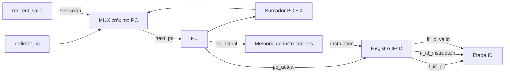

# Etapa IF — Instruction Fetch

Este documento describe el diseño conceptual de la etapa IF del procesador segmentado.

La responsabilidad principal de IF es mantener el PC, obtener la instrucción correspondiente desde la memoria de instrucciones y entregar al registro IF/ID la instrucción junto con su PC y su indicador de validez.

## Responsabilidades

La etapa IF debe:

- mantener la dirección actual mediante el PC;
- calcular el candidato secuencial `PC + 4`;
- seleccionar el próximo valor del PC;
- consultar la memoria de instrucciones;
- almacenar en IF/ID la instrucción obtenida, su PC y su validez;
- permitir detener el avance mediante `if_enable`;
- permitir invalidar IF/ID mediante `flush_if_id`;
- permitir redirigir el PC cuando posteriormente se resuelva un branch o jump.

## Diagrama conceptual

## Elementos de estado

### PC

El PC es un registro que mantiene la dirección utilizada actualmente por IF.

Conceptualmente:

- con `reset`, vuelve a la dirección inicial;
- con `if_enable = 1`, captura `next_pc` en el flanco;
- con `if_enable = 0`, conserva su valor anterior.

### IF/ID

IF/ID es el registro de segmentación ubicado entre las etapas IF e ID.

Mantiene juntos:

- `if_id_pc`;
- `if_id_instruction`;
- `if_id_valid`.

Estos valores deben avanzar juntos para conservar la relación entre una instrucción y la dirección desde la cual fue obtenida.

## Lógica combinacional

### Cálculo de PC + 4

El sumador recibe el PC actual y calcula:

`pc_plus_4 = pc_actual + 4`

Este bloque no almacena estado.

### Selección del próximo PC

El próximo PC se selecciona entre:

- `pc_plus_4`, para ejecución secuencial;
- `redirect_pc`, cuando una instrucción modifica el flujo de ejecución.

Conceptualmente:

`redirect_valid = 0 → next_pc = pc_plus_4`

`redirect_valid = 1 → next_pc = redirect_pc`

## Memoria de instrucciones

La memoria de instrucciones recibe la dirección contenida en el PC y entrega la instrucción correspondiente.

En el modelo conceptual utilizado en esta etapa, la lectura se considera combinacional.

Como las instrucciones ocupan cuatro bytes y las direcciones utilizadas por el PC son direcciones de byte, una dirección alineada permite obtener el índice de palabra ignorando conceptualmente los dos bits menos significativos.

Ejemplo:

`PC = 12 → índice de palabra = 12 / 4 = 3`

## Control de avance

### if_enable

`if_enable` controla si los registros asociados al avance de IF pueden capturar nuevos valores.

Si:

`if_enable = 1`

el PC y IF/ID pueden avanzar en el próximo flanco.

Si:

`if_enable = 0`

el PC e IF/ID conservan sus valores anteriores.

Esto permitirá implementar stalls posteriormente.

### flush_if_id

`flush_if_id` invalida la instrucción almacenada en IF/ID.

Cuando se produce un flush:

`if_id_valid = 0`

Los bits correspondientes al PC y a la instrucción pueden seguir físicamente presentes, pero ya no representan una instrucción válida que deba producir efectos.

## Funcionamiento secuencial normal

Supongamos:

`PC = 8`

y además:

`redirect_valid = 0`

`if_enable = 1`

`flush_if_id = 0`

Durante el ciclo:

`IMEM` responde a la dirección 8.

El sumador calcula:

`pc_plus_4 = 12`

El selector de próximo PC produce:

`next_pc = 12`

En el siguiente flanco:

`PC ← 12`

y IF/ID captura:

`if_id_pc ← 8`

`if_id_instruction ← instrucción obtenida en la dirección 8`

`if_id_valid ← 1`

Durante el ciclo siguiente, IF comienza a buscar la instrucción correspondiente a PC=12 mientras ID trabaja con la instrucción almacenada en IF/ID.

## Caso de redirección

Si:

`PC = 40`

`redirect_valid = 1`

`redirect_pc = 200`

entonces:

`next_pc = 200`

y el PC puede capturar 200 en el próximo flanco habilitado.

Este mecanismo permitirá posteriormente utilizar destinos provenientes de branches, JAL y JALR.

## Caso de stall

Si:

`if_enable = 0`

entonces:

- el PC conserva su valor;
- IF/ID conserva su contenido.

De esta manera IF no avanza mientras una etapa posterior necesita detener el pipeline.

## Caso de flush

Si:

`flush_if_id = 1`

entonces IF/ID debe quedar inválido:

`if_id_valid = 0`

Esto permite eliminar una instrucción que fue buscada pero posteriormente se determinó que no debía continuar por el pipeline.

## Interfaz conceptual de la etapa IF

### Entradas

`clk`

Reloj utilizado por los elementos de estado de IF.

`reset`

Coloca la etapa en un estado inicial conocido. El PC vuelve a la dirección inicial y IF/ID queda inválido.

`if_enable`

Controla el avance normal de la etapa.

- `if_enable = 1`: PC e IF/ID pueden avanzar.
- `if_enable = 0`: PC e IF/ID mantienen su contenido.

`redirect_valid`

Indica que el próximo PC debe provenir de una redirección y no de `PC + 4`.

`redirect_pc`

Contiene la dirección que debe utilizarse como próximo PC cuando `redirect_valid = 1`.

`flush_if_id`

Indica que la instrucción almacenada en IF/ID debe invalidarse.

### Salidas hacia ID

`if_id_pc`

PC asociado a la instrucción almacenada en IF/ID.

`if_id_instruction`

Instrucción almacenada en el registro IF/ID.

`if_id_valid`

Indica si el contenido de IF/ID representa una instrucción válida.

### Salida de observación

`pc_current`

Valor actual del PC.

Esta salida podrá utilizarse posteriormente para depuración y para la Debug Unit.

## Prioridad de las señales de control

Para evitar comportamientos ambiguos, se define una prioridad conceptual.

### Actualización del PC

1. `reset`
2. `redirect_valid`
3. `if_enable`
4. mantener valor anterior

Conceptualmente:

- si `reset = 1`, el PC vuelve a la dirección inicial;
- si no hay reset y `redirect_valid = 1`, el PC captura `redirect_pc`;
- si no hay reset ni redirección y `if_enable = 1`, el PC captura `PC + 4`;
- en caso contrario, conserva su valor.

### Actualización de IF/ID

1. `reset`
2. `flush_if_id`
3. `if_enable`
4. mantener contenido anterior

Conceptualmente:

- si `reset = 1`, `if_id_valid = 0`;
- si no hay reset y `flush_if_id = 1`, `if_id_valid = 0`;
- si no hay reset ni flush y `if_enable = 1`, IF/ID captura el PC y la instrucción actuales y marca `if_id_valid = 1`;
- en caso contrario, IF/ID conserva su contenido.

La prioridad del flush sobre el enable permite invalidar una instrucción incorrecta incluso cuando el avance normal del pipeline se encuentra detenido.

Una redirección del PC y un flush de IF/ID son controles diferentes. Una redirección cambia desde dónde continuará buscando IF, mientras que un flush invalida una instrucción que ya había entrado al pipeline.

## Implementación RTL

La etapa IF fue dividida en los siguientes módulos:

- `program_counter`: mantiene el PC actual.
- `instruction_memory`: memoria de instrucciones con lectura combinacional en esta primera versión.
- `if_id_register`: registro de segmentación entre IF e ID.
- `if_stage`: integra los módulos anteriores y contiene la lógica combinacional de `PC + 4`, selección de próximo PC y habilitación del PC.

### Program Counter

El PC utiliza un reset síncrono.

Prioridad:

`reset > enable > mantener`

Cuando `enable = 1`, el registro captura `next_pc` en el flanco ascendente.

Cuando `enable = 0`, conserva su valor anterior.

### Instruction Memory

La primera implementación utiliza lectura combinacional.

La dirección recibida por la memoria es una dirección de byte, mientras que internamente se almacenan palabras de 32 bits.

Por esto se utiliza conceptualmente:

`índice = address / 4`

implementado mediante los bits:

`address[31:2]`

Esta memoria es todavía una implementación inicial para validar IF. Más adelante deberá incorporarse el mecanismo de escritura necesario para cargar y reprogramar el programa mediante UART sin resintetizar el procesador.

### Registro IF/ID

El registro IF/ID conserva juntos:

- PC;
- instrucción;
- indicador de validez.

Su prioridad es:

`reset > flush > enable > mantener`

Un stall conserva todos los campos.

Un flush mantiene físicamente PC e instrucción, pero coloca:

`valid = 0`

de manera que esos bits dejan de representar una instrucción válida.

### Integración

La etapa integrada utiliza:

`pc_plus_4 = pc_current + 4`

La selección de próximo PC es:

`redirect_valid = 0 → next_pc = pc_plus_4`

`redirect_valid = 1 → next_pc = redirect_pc`

Para respetar la prioridad de una redirección sobre un stall:

`pc_enable = if_enable OR redirect_valid`

De esta forma una redirección puede actualizar el PC incluso si el avance secuencial se encuentra detenido.

El clock no se modifica ni se interrumpe. El control del avance se realiza mediante señales de enable sobre los registros.

## Validación mediante simulación

Las simulaciones fueron realizadas con Vivado/XSim 2025.1 utilizando SystemVerilog.

El flujo utilizado fue:

`xvlog → xelab → xsim`

Para observar waveforms se elaboraron los diseños utilizando:

`xelab ... -debug typical`

### program_counter

Resultado:

`PASS: program_counter`

Se verificó:

- reset del PC a cero;
- captura de `next_pc` con `enable = 1`;
- conservación del PC con `enable = 0`;
- prioridad de reset sobre enable.

### instruction_memory

Resultado:

`PASS: instruction_memory`

Se verificó:

- dirección 0 → palabra 0;
- dirección 4 → palabra 1;
- dirección 8 → palabra 2;
- dirección 12 → palabra 3;
- cambio combinacional de la instrucción sin esperar un flanco de clock.

### if_id_register

Resultado:

`PASS: if_id_register`

Se verificó:

- reset;
- captura normal de PC, instrucción y valid;
- stall mediante `enable = 0`;
- flush mediante `valid_out = 0`;
- nueva captura después de un flush;
- prioridad de reset.

### if_stage

Resultado:

`PASS: if_stage`

Se verificó el funcionamiento integrado de toda la etapa:

- avance secuencial del PC;
- asociación correcta entre instrucción y PC en IF/ID;
- IF/ID permanece un ciclo detrás del PC utilizado actualmente por IF;
- stall de PC e IF/ID;
- reanudación después de un stall;
- redirección del PC;
- prioridad de redirect sobre stall;
- flush simultáneo de IF/ID;
- continuación correcta desde la dirección redirigida.

Ejemplo observado en simulación:

`pc_current = 44`

mientras:

`if_id_pc = 40`

`if_id_instruction = EEEEEEEE`

`if_id_valid = 1`

Esto demuestra que IF ya está trabajando con la siguiente dirección mientras ID dispone de la instrucción capturada en el ciclo anterior.

## Limitaciones y trabajo posterior

La memoria de instrucciones implementada en este paso es todavía provisional.

Queda pendiente para etapas posteriores:

- permitir escritura de la memoria de programa;
- cargar y reprogramar instrucciones mediante UART;
- definir el comportamiento frente a direcciones fuera del programa cargado;
- integrar el mecanismo de parada/HALT;
- determinar cómo se invalida el fetch cuando finaliza el programa;
- evaluar posteriormente la implementación física de la memoria en FPGA, incluyendo memoria distribuida, Block RAM o recursos/IP de Vivado.

Estas decisiones no modifican la validación conceptual realizada en este paso para la etapa IF.
